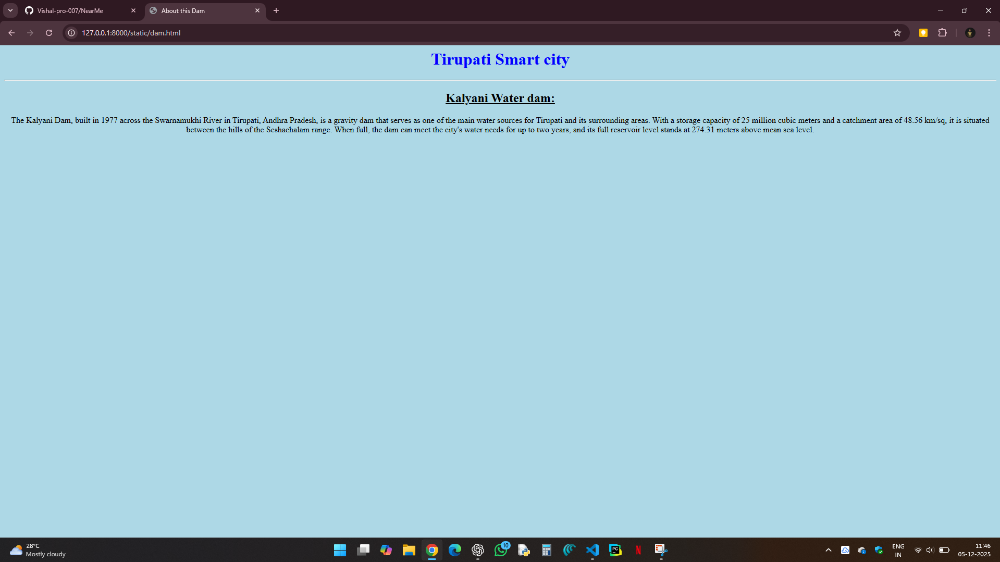
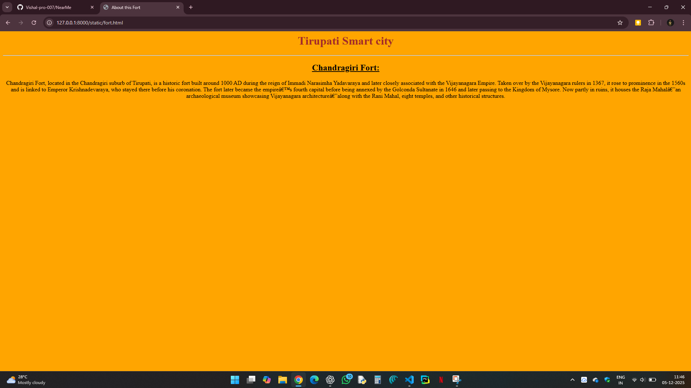
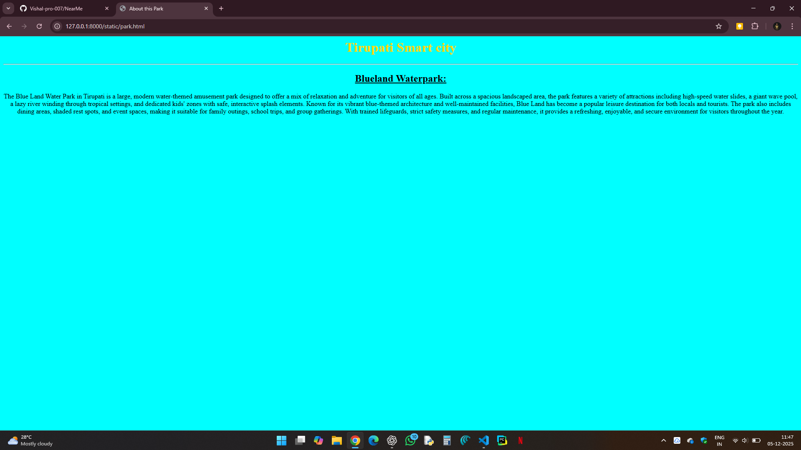
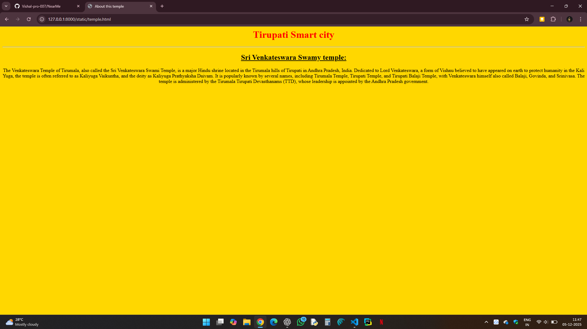
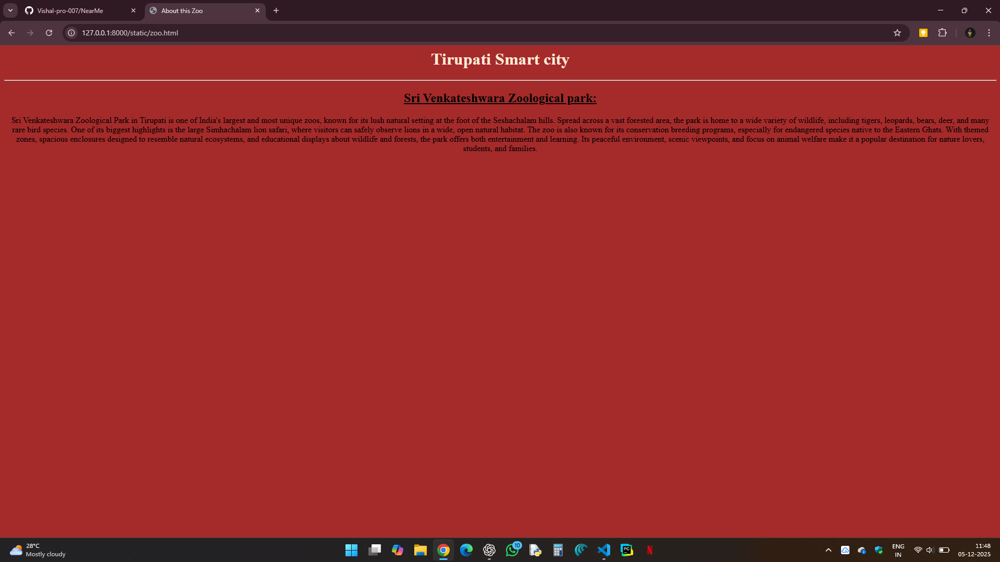

# Ex03 Places Around Me
## Date: 5.12.2025

## AIM
To develop a website to display details about the places around my house.

## DESIGN STEPS

### STEP 1
Create a Django admin interface.

### STEP 2
Download your city map from Google as an image.

### STEP 3
Insert the image using `````` tag and link it to the map.

### STEP 4
Using ```<map>``` tag name the map.

### STEP 5
Create clickable regions in the image using ```<area>``` tag.

### STEP 6
Write HTML programs for all the regions identified.

### STEP 7
Execute the programs and publish them.

## CODE
```
1. Map.html
<html>
    <head>
        <title>Tirupati smart city map</title>
    </head>
    <body align="center" bgcolor="lightblue">
        <h1>Tirupati Smart City</h1>
        <h2>Vishal S (25013120)</h2>
        

<map name="image-map">
    <area target="" alt="Sri Venkateshwara temple" title="Sri Venkateshwara temple" href="temple.html" coords="859,22,1106,93" shape="rect">
    <area target="" alt="Kalyani Dam" title="Kalyani Dam" href="dam.html" coords="430,194,190,228,398,284,434,244" shape="poly">
    <area target="" alt="Chandragiri Fort" title="Chandragiri Fort" href="fort.html" coords="602,753,44" shape="circle">
    <area target="" alt="Blueland waterpark" title="Blueland waterpark" href="park.html" coords="488,843,678,882" shape="rect">
    <area target="" alt="Sri Venkateshwara zoo park" title="Sri Venkateshwara zoo park" href="zoo.html" coords="850,421,1054,498" shape="rect">
</map>


        
    </body>
</html>

2. Dam.html
<html>
    <head>
        <title>About this Dam</title>
    </head>
    <body align="center" bgcolor="lightblue"></body>
    <h1 style="color:blue">Tirupati Smart city</h1>
    <hr>
    <h2><u>Kalyani Water dam:</u></h2>
    <p>The Kalyani Dam, built in 1977 across the Swarnamukhi River in Tirupati, Andhra Pradesh, is a gravity dam that serves as one of the main water sources for Tirupati and its surrounding areas. With a storage capacity of 25 million cubic meters and a catchment area of 48.56 km/sq, it is situated between the hills of the Seshachalam range. When full, the dam can meet the city's water needs for up to two years, and its full reservoir level stands at 274.31 meters above mean sea level.</p>
</html>

3. Fort.html
<html>
    <head>
        <title>About this Fort</title>
    </head>
    <body align="center" bgcolor="orange"></body>
    <h1 style="color:brown">Tirupati Smart city</h1>
    <hr>
    <h2><u>Chandragiri Fort:</u></h2>
    <p>Chandragiri Fort, located in the Chandragiri suburb of Tirupati, is a historic fort built around 1000 AD during the reign of Immadi Narasimha Yadavaraya and later closely associated with the Vijayanagara Empire. Taken over by the Vijayanagara rulers in 1367, it rose to prominence in the 1560s and is linked to Emperor Krishnadevaraya, who stayed there before his coronation. The fort later became the empire’s fourth capital before being annexed by the Golconda Sultanate in 1646 and later passing to the Kingdom of Mysore. Now partly in ruins, it houses the Raja Mahal—an archaeological museum showcasing Vijayanagara architecture—along with the Rani Mahal, eight temples, and other historical structures.</p>
</html>

4. Temple.html
<html>
    <head>
        <title>About this temple</title>
    </head>
    <body align="center" bgcolor="gold"></body>
    <h1 style="color:red">Tirupati Smart city</h1>
    <hr>
    <h2><u>Sri Venkateswara Swamy temple:</u></h2>
    <p>The Venkateswara Temple of Tirumala, also called the Sri Venkateswara Swami Temple, is a major Hindu shrine located in the Tirumala hills of Tirupati in Andhra Pradesh, India. Dedicated to Lord Venkateswara, a form of Vishnu believed to have appeared on earth to protect humanity in the Kali Yuga, the temple is often referred to as Kaliyuga Vaikuntha, and the deity as Kaliyuga Prathyaksha Daivam. It is popularly known by several names, including Tirumala Temple, Tirupati Temple, and Tirupati Balaji Temple, with Venkateswara himself also called Balaji, Govinda, and Srinivasa. The temple is administered by the Tirumala Tirupati Devasthanams (TTD), whose leadership is appointed by the Andhra Pradesh government.
    </p>
</html>

5. Zoo.html
<html>
    <head>
        <title>About this Zoo</title>
    </head>
    <body align="center" bgcolor="brown"></body>
    <h1 style="color:antiquewhite">Tirupati Smart city</h1>
    <hr>
    <h2><u>Sri Venkateshwara Zoological park:</u></h2>
    <p>Sri Venkateshwara Zoological Park in Tirupati is one of India's largest and most unique zoos, known for its lush natural setting at the foot of the Seshachalam hills. Spread across a vast forested area, the park is home to a wide variety of wildlife, including tigers, leopards, bears, deer, and many rare bird species. One of its biggest highlights is the large Simhachalam lion safari, where visitors can safely observe lions in a wide, open natural habitat. The zoo is also known for its conservation breeding programs, especially for endangered species native to the Eastern Ghats. With themed zones, spacious enclosures designed to resemble natural ecosystems, and educational displays about wildlife and forests, the park offers both entertainment and learning. Its peaceful environment, scenic viewpoints, and focus on animal welfare make it a popular destination for nature lovers, students, and families.
</p>
</html>

```


## OUTPUT
map.html


dam.html


fort.html


park.html


temple.html


zoo.html
j


## RESULT
The program for implementing image maps using HTML is executed successfully.
